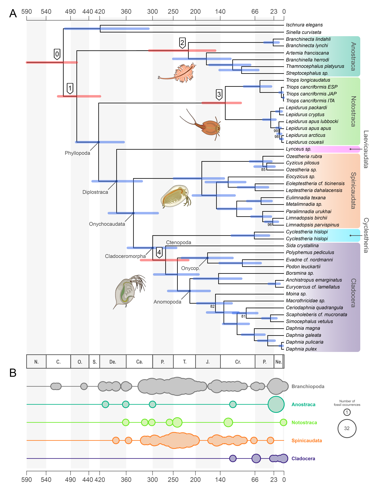

# A temporal framework for the origin and diversification of Branchiopoda — Data and code

In this repository you will find data and codes used to perform the phylogenomic and time-tree calibration analyses for the research paper:
> [Righetti N](https://github.com/NiccoloRighetti), [Nicolini F](https://github.com/filonico), [Forni G](https://github.com/for-giobbe), [Luchetti A](https://github.com/andluche). A temporal framework for the origin and diversification of Branchiopoda.
>
> **Abstract.** bla bla bla.

## Phylogenomic analysis
We obtained a ML phylogenetic tree of branchiopods with IQ-TREE, using both genomic and transcriptomic resources for a total of 48 species (including two outgroups). Data are shown in **Supplementary Table S1**, in [<code>dataset.tsv</code>](./dataset.tsv) (parsable version) and below.

<ins>Supplementary Table S1: <b>dataset</b></ins>

| Species                       | ID   | Subclass   | Superorder    | Group          | Order         | Family            | GenBank Accession Number                                                                               | BUSCO statistics                        | BUSCO genes for phylogenomics | Reference                  |
| ----------------------------- | ---- | ---------- | ------------- | -------------- | ------------- | ----------------- | ------------------------------------------------------------------------------------------------------ | --------------------------------------- | ----------------------------- | -------------------------- |
| *Ischnura elegans*              | Iele | Outgroup   | Outgroup      | Outgroup       | Outgroup      | Outgroup          | [GCA_921293095.1](https://www.ncbi.nlm.nih.gov/datasets/genome/GCA_921293095.1/)                       | C:98.0%[S:97.4%,D:0.6%],F:0.9%,M:1.1%   | 134                           | Price et al., 2022         |
| *Sinella curviseta*             | Scur | Outgroup   | Outgroup      | Outgroup       | Outgroup      | Outgroup          | [GCA_004115045.3](https://www.ncbi.nlm.nih.gov/datasets/genome/GCA_004115045.3/)                       | C:96.3%[S:93.7%,D:2.6%],F:1.3%,M:2.4%   | 129                           | Zhang et al., 2019         |
| *Branchinecta lindahli*         | Blin | Sarsotraca | \-            | \-             | Anostraca     | Branchinectidae   | [GCA_023053555.1](https://www.ncbi.nlm.nih.gov/datasets/genome/GCA_023053555.1/)                       | C:90.8%[S:90.5%,D:0.3%],F:3.5%,M:5.7%   | 131                           | Kieran Blair et al., 2023a |
| *Branchinecta lynchi*           | Blyn | Sarsotraca | \-            | \-             | Anostraca     | Branchinectidae   | [GCA_023053575.1](https://www.ncbi.nlm.nih.gov/datasets/genome/GCA_023053575.1/)                       | C:90.1%[S:89.4%,D:0.7%],F:4.0%,M:5.9%   | 130                           | Kieran Blair et al., 2023b |
| *Artemia franciscana*           | Afr1 | Sarsotraca | \-            | \-             | Anostraca     | Artemiidae        | [Korea Polar Research Institute](https://antagen.kopri.re.kr/project/genome_info_iframe.php?Code=AF01) | C:66.4%[S:62.5%,D:3.9%],F:20.5%,M:13.1% | 105                           | NA                         |
| *Branchinella herrodi*          | Bher | Sarsotraca | \-            | \-             | Anostraca     | Thamnocephalidae  | [SRR4113492](https://trace.ncbi.nlm.nih.gov/Traces?run=SRR4113492)                                     | C:75.2%[S:73.4%,D:1.8%],F:14.3%,M:10.5% | 123                           | Schwentner et al., 2018    |
| *Streptocephalus sp.*           | Stsp | Sarsotraca | \-            | \-             | Anostraca     | Streptocephalidae | [SRR5140122](https://trace.ncbi.nlm.nih.gov/Traces?run=SRR5140122)                                     | C:21.7%[S:21.5%,D:0.2%],F:36.5%,M:41.8% | 90                            | Schwentner et al., 2018    |
| *Thamnocephalus platyurus*      | Tpla | Sarsotraca | \-            | \-             | Anostraca     | Thamnocephalidae  | [SRR5140150](https://trace.ncbi.nlm.nih.gov/Traces?run=SRR5140150)                                     | C:35.4%[S:35.1%,D:0.3%],F:37.4%,M:27.2% | 118                           | Schwentner et al., 2018    |
| *Triops cancriformis* ESP       | Tces | Phyllopoda | Calmanostraca | \-             | Notostraca    | Triopsidae        | [GCA_022832265.1](https://www.ncbi.nlm.nih.gov/datasets/genome/GCA_022832265.1/)                       | C:96.2%[S:87.8%,D:8.4%],F:2.3%,M:1.5%   | 124                           | Luchetti et al., 2021      |
| *Triops cancriformis* ITA       | Tcit | Phyllopoda | Calmanostraca | \-             | Notostraca    | Triopsidae        | [GCA_022832245.1](https://www.ncbi.nlm.nih.gov/datasets/genome/GCA_022832245.1/)                       | C:96.6%[S:96.3%,D:0.3%],F:2.4%,M:1.0%   | 134                           | Luchetti et al., 2021      |
| *Triops cancriformis* JPN       | Tcjp | Phyllopoda | Calmanostraca | \-             | Notostraca    | Triopsidae        | [GCA_000981345.1](https://www.ncbi.nlm.nih.gov/datasets/genome/GCA_000981345.1/)                       | C:94.8%[S:94.7%,D:0.1%],F:3.8%,M:1.4%   | 133                           | Ikeda et al., 2015         |
| *Triops longicaudatus*          | Tlon | Phyllopoda | Calmanostraca | \-             | Notostraca    | Triopsidae        | [GCA_022885665.1](https://www.ncbi.nlm.nih.gov/datasets/genome/GCA_022885665.1/)                       | C:97.3%[S:97.1%,D:0.2%],F:2.1%,M:0.6%   | 134                           | Luchetti et al., 2021      |
| *Lepidurus apus apus*           | Lapu | Phyllopoda | Calmanostraca | \-             | Notostraca    | Triopsidae        | [GCA_022832285.1](https://www.ncbi.nlm.nih.gov/datasets/genome/GCA_022832285.1/)                       | C:97.6%[S:96.6%,D:1.0%],F:1.6%,M:0.8%   | 132                           | Luchetti et al., 2021      |
| *Lepidurus arcticus*            | Lart | Phyllopoda | Calmanostraca | \-             | Notostraca    | Triopsidae        | [GCA_003724045.1](https://www.ncbi.nlm.nih.gov/datasets/genome/GCA_003724045.1/)                       | C:97.5%[S:96.2%,D:1.3%],F:1.6%,M:0.9%   | 133                           | Savojardo et al., 2019     |
| *Lepidurus couesii*             | Lcou | Phyllopoda | Calmanostraca | \-             | Notostraca    | Triopsidae        | [GCA_022832235.1](https://www.ncbi.nlm.nih.gov/datasets/genome/GCA_022832235.1/)                       | C:95.9%[S:90.6%,D:5.3%],F:2.7%,M:1.4%   | 128                           | Luchetti et al., 2021      |
| *Lepidurus cryptus*             | Lcry | Phyllopoda | Calmanostraca | \-             | Notostraca    | Triopsidae        | [SRR5140152](https://trace.ncbi.nlm.nih.gov/Traces?run=SRR5140152)                                     | C:62.5%[S:62.0%,D:0.5%],F:25.8%,M:11.7% | 127                           | Schwentner et al., 2018    |
| *Lepidurus packardi*            | Lpac | Phyllopoda | Calmanostraca | \-             | Notostraca    | Triopsidae        | [GCA_023053545.1](https://www.ncbi.nlm.nih.gov/datasets/genome/GCA_023053545.1/)                       | C:97.2%[S:96.7%,D:0.5%],F:1.4%,M:1.4%   | 134                           | Kieran Blair et al., 2022  |
| *Lepidurus apus lubbocki*       | Lubb | Phyllopoda | Calmanostraca | \-             | Notostraca    | Triopsidae        | [GCA_003723985.1](https://www.ncbi.nlm.nih.gov/datasets/genome/GCA_003723985.1/)                       | C:97.8%[S:89.2%,D:8.6%],F:1.4%,M:0.8%   | 124                           | Savojardo et al., 2019     |
| *Lynceus sp.*                   | Lysp | Phyllopoda | Diplostraca   | "Conchostraca" | Laevicaudata  | Lynceidae         | [SRR5140145](https://trace.ncbi.nlm.nih.gov/Traces?run=SRR5140145)                                     | C:65.7%[S:65.2%,D:0.5%],F:23.6%,M:10.7% | 125                           | Schwentner et al., 2018    |
| *Cyzicus pilosus*               | Cpil | Phyllopoda | Diplostraca   | "Conchostraca" | Spinicaudata  | Cyzicidae         | [SRR5140139](https://trace.ncbi.nlm.nih.gov/Traces?run=SRR5140139)                                     | C:63.9%[S:61.6%,D:2.3%],F:24.8%,M:11.3% | 124                           | Schwentner et al., 2018    |
| *Ozestheria rubra*              | Orub | Phyllopoda | Diplostraca   | "Conchostraca" | Spinicaudata  | Cyzicidae         | [SRR4113504](https://trace.ncbi.nlm.nih.gov/Traces?run=SRR4113504)                                     | C:62.4%[S:60.9%,D:1.5%],F:25.9%,M:11.7% | 127                           | Schwentner et al., 2018    |
| *Ozestheria sp.*                | Ozsp | Phyllopoda | Diplostraca   | "Conchostraca" | Spinicaudata  | Cyzicidae         | [SRR5140151](https://trace.ncbi.nlm.nih.gov/Traces?run=SRR5140151)                                     | C:23.8%[S:23.7%,D:0.1%],F:32.6%,M:43.6% | 100                           | Schwentner et al., 2018    |
| *Eocyzicus sp.*                 | Eosp | Phyllopoda | Diplostraca   | "Conchostraca" | Spinicaudata  | Eocyzicidae       | [SRR5140111](https://trace.ncbi.nlm.nih.gov/Traces?run=SRR5140111)                                     | C:79.1%[S:76.7%,D:2.4%],F:14.7%,M:6.2%  | 128                           | Schwentner et al., 2018    |
| *Eoleptestheria cf. ticinensis* | Etic | Phyllopoda | Diplostraca   | "Conchostraca" | Spinicaudata  | Leptestheriidae   | [SRR5140141](https://trace.ncbi.nlm.nih.gov/Traces?run=SRR5140141)                                     | C:71.1%[S:69.0%,D:2.1%],F:19.1%,M:9.8%  | 130                           | Schwentner et al., 2018    |
| *Leptestheria dahalacensis*     | Ldah | Phyllopoda | Diplostraca   | "Conchostraca" | Spinicaudata  | Leptestheriidae   | [GCA_022114935.1](https://www.ncbi.nlm.nih.gov/datasets/genome/GCA_022114935.1/)                       | C:92.9%[S:90.1%,D:2.8%],F:3.4%,M:3.7%   | 128                           | Luchetti et al., 2021      |
| *Eulimnadia texana*             | Etex | Phyllopoda | Diplostraca   | "Conchostraca" | Spinicaudata  | Limnadiidae       | [GCA_002872375.1](https://www.ncbi.nlm.nih.gov/datasets/genome/GCA_002872375.1/)                       | C:98.8%[S:94.4%,D:4.4%],F:0.7%,M:0.5%   | 131                           | Baldwin-Brown et al., 2018 |
| *Limnadopsis birchii*           | Lbir | Phyllopoda | Diplostraca   | "Conchostraca" | Spinicaudata  | Limnadiidae       | [SRR5140136](https://trace.ncbi.nlm.nih.gov/Traces?run=SRR5140136)                                     | C:40.0%[S:38.2%,D:1.8%],F:38.5%,M:21.5% | 111                           | Schwentner et al., 2018    |
| *Limnadopsis parvispinus*       | Lpar | Phyllopoda | Diplostraca   | "Conchostraca" | Spinicaudata  | Limnadiidae       | [SRR5140106](https://trace.ncbi.nlm.nih.gov/Traces?run=SRR5140106)                                     | C:34.1%[S:33.1%,D:1.0%],F:38.0%,M:27.9% | 120                           | Schwentner et al., 2018    |
| *Metalimnadia sp.*              | Mesp | Phyllopoda | Diplostraca   | "Conchostraca" | Spinicaudata  | Limnadiidae       | [SRR5140110](https://trace.ncbi.nlm.nih.gov/Traces?run=SRR5140110)                                     | C:46.4%[S:45.1%,D:1.3%],F:35.1%,M:18.5% | 119                           | Schwentner et al., 2018    |
| *Paralimnadia urukhai*          | Puru | Phyllopoda | Diplostraca   | "Conchostraca" | Spinicaudata  | Limnadiidae       | [SRR5140109](https://trace.ncbi.nlm.nih.gov/Traces?run=SRR5140109)                                     | C:67.3%[S:66.3%,D:1.0%],F:22.4%,M:10.3% | 131                           | Schwentner et al., 2018    |
| *Cyclestheria hislopi*          | C146 | Phyllopoda | Diplostraca   | "Conchostraca" | Cyclestherida | Cyclestheriidae   | [SRR5140134](https://trace.ncbi.nlm.nih.gov/Traces?run=SRR5140134)                                     | C:70.5%[S:69.6%,D:0.9%],F:20.9%,M:8.6%  | 129                           | Schwentner et al., 2018    |
| *Cyclestheria hislopi*          | Chis | Phyllopoda | Diplostraca   | "Conchostraca" | Cyclestherida | Cyclestheriidae   | [SRR5140140](https://trace.ncbi.nlm.nih.gov/Traces?run=SRR5140140)                                     | C:81.1%[S:80.4%,D:0.7%],F:14.5%,M:4.4%  | 130                           | Schwentner et al., 2018    |
| *Sida crystallina*              | Scry | Phyllopoda | Diplostraca   | Cladocera      | Ctenopoda     | Sididae           | [SRR5140104](https://trace.ncbi.nlm.nih.gov/Traces?run=SRR5140104)                                     | C:82.0%[S:81.0%,D:1.0%],F:12.7%,M:5.3%  | 134                           | Schwentner et al., 2018    |
| *Polyphemus pediculus*          | Pped | Phyllopoda | Diplostraca   | Cladocera      | Onychopoda    | Polyphemidae      | [SRR5140114](https://trace.ncbi.nlm.nih.gov/Traces?run=SRR5140114)                                     | C:52.6%[S:51.9%,D:0.7%],F:30.6%,M:16.8% | 125                           | Schwentner et al., 2018    |
| *Evadne cf. nordmanni*          | Enor | Phyllopoda | Diplostraca   | Cladocera      | Onychopoda    | Podonidae         | [SRR5140118](https://trace.ncbi.nlm.nih.gov/Traces?run=SRR5140118)                                     | C:66.1%[S:65.0%,D:1.1%],F:23.8%,M:10.1% | 125                           | Schwentner et al., 2018    |
| *Podon leuckartii*              | Pleu | Phyllopoda | Diplostraca   | Cladocera      | Onychopoda    | Podonidae         | [SRR5140133](https://trace.ncbi.nlm.nih.gov/Traces?run=SRR5140133)                                     | C:63.5%[S:63.1%,D:0.4%],F:19.1%,M:17.4% | 126                           | Schwentner et al., 2018    |
| *Bosmina sp.*                   | Bosp | Phyllopoda | Diplostraca   | Cladocera      | Anomopoda     | Bosminidae        | [SRR5140102](https://trace.ncbi.nlm.nih.gov/Traces?run=SRR5140102)                                     | C:34.9%[S:34.6%,D:0.3%],F:34.7%,M:30.4% | 112                           | Schwentner et al., 2018    |
| *Anchistropus emarginatus*      | Aema | Phyllopoda | Diplostraca   | Cladocera      | Anomopoda     | Chydoridae        | [SRR5140156](https://trace.ncbi.nlm.nih.gov/Traces?run=SRR5140156)                                     | C:90.5%[S:89.9%,D:0.6%],F:6.3%,M:3.2%   | 134                           | Schwentner et al., 2018    |
| *Eurycercus cf. lamellatus*     | Elam | Phyllopoda | Diplostraca   | Cladocera      | Anomopoda     | Eurycercidae      | [SRR5140146](https://trace.ncbi.nlm.nih.gov/Traces?run=SRR5140146)                                     | C:80.5%[S:79.5%,D:1.0%],F:13.2%,M:6.3%  | 128                           | Schwentner et al., 2018    |
| *Moina sp.*                     | Mosp | Phyllopoda | Diplostraca   | Cladocera      | Anomopoda     | Moinidae          | [SRR5140125](https://trace.ncbi.nlm.nih.gov/Traces?run=SRR5140125)                                     | C:91.0%[S:89.6%,D:1.4%],F:6.2%,M:2.8%   | 128                           | Schwentner et al., 2018    |
| *Macrothricidae sp.*            | Masp | Phyllopoda | Diplostraca   | Cladocera      | Anomopoda     | Macrothricidae    | [SRR5140158](https://trace.ncbi.nlm.nih.gov/Traces?run=SRR5140158)                                     | C:84.3%[S:83.6%,D:0.7%],F:11.4%,M:4.3%  | 133                           | Schwentner et al., 2018    |
| *Ceriodaphnia quadrangula*      | Cqua | Phyllopoda | Diplostraca   | Cladocera      | Anomopoda     | Daphniidae        | [SRR5140137](https://trace.ncbi.nlm.nih.gov/Traces?run=SRR5140137)                                     | C:61.5%[S:59.6%,D:1.9%],F:26.6%,M:11.9% | 125                           | Schwentner et al., 2018    |
| *Daphnia galeata*               | Dgal | Phyllopoda | Diplostraca   | Cladocera      | Anomopoda     | Daphniidae        | [GCA_918697745.1](https://www.ncbi.nlm.nih.gov/datasets/genome/GCA_918697745.1/)                       | C:95.2%[S:94.2%,D:1.0%],F:1.5%,M:3.3%   | 130                           | Nickel et al., 2021        |
| *Daphnia magna*                 | Dmag | Phyllopoda | Diplostraca   | Cladocera      | Anomopoda     | Daphniidae        | [GCF_003990815.1](https://www.ncbi.nlm.nih.gov/datasets/genome/GCF_003990815.1/)                       | C:98.6%[S:94.4%,D:4.2%],F:0.6%,M:0.8%   | 130                           | Lee et al., 2019           |
| *Daphnia pulicaria*             | Dpli | Phyllopoda | Diplostraca   | Cladocera      | Anomopoda     | Daphniidae        | [GCA_021234035.2](https://www.ncbi.nlm.nih.gov/datasets/genome/GCA_021234035.2/)                       | C:98.8%[S:97.2%,D:1.6%],F:0.7%,M:0.5%   | 131                           | Wersebe et al., 2023       |
| *Daphnia pulex*                 | Dpul | Phyllopoda | Diplostraca   | Cladocera      | Anomopoda     | Daphniidae        | [GCA_000187875.1](https://www.ncbi.nlm.nih.gov/datasets/genome/GCA_000187875.1/)                       | C:98.1%[S:97.9%,D:0.2%],F:0.6%,M:1.3%   | 132                           | Colbourne et al., 2011     |
| *Scapholeberis cf. mucronata*   | Smuc | Phyllopoda | Diplostraca   | Cladocera      | Anomopoda     | Daphniidae        | [SRR5140113](https://trace.ncbi.nlm.nih.gov/Traces?run=SRR5140113)                                     | C:77.5%[S:77.4%,D:0.1%],F:14.9%,M:7.6%  | 130                           | Schwentner et al., 2018    |
| *Simocephalus vetulus*          | Svet | Phyllopoda | Diplostraca   | Cladocera      | Anomopoda     | Daphniidae        | [SRR5140138](https://trace.ncbi.nlm.nih.gov/Traces?run=SRR5140138)                                     | C:81.4%[S:81.1%,D:0.3%],F:13.0%,M:5.6%  | 133                           | Schwentner et al., 2018    |

Input fasta files, best-models as returned by Model Finder, and the resulting tree can be found in [<code>01_phylogenomics/</code>](./01_phylogenomics/).

## Time-tree calibration
The time-tree was calibrated after the previously-obtained phylogenetic tree using MCMCtree. Age priors are defined as in **Table 1**, in [<code>age_priors.tsv</code>](./age_priors.tsv), and below.

<ins>Table 1: <b>age priors</b></ins>

| Group                                    | Node code | Fossil                         | Min. Age (Ma) | Max. Age (Ma) | Reference          |
| ---------------------------------------- | --------- | ------------------------------ | ------------- | ------------- | ------------------ |
| Branchiopoda + Hexapoda (Allotriocardia) | 0         | *Rehbachiella kinnekullensis*    | 497.00        | 636.00        | Wolfe et al., 2016 |
| Branchiopoda crown group                 | 1         | *Lepidocaris rhyniensis*         | 405.00        | 521.00 (soft) | Wolfe et al., 2016 |
| Anostraca crown group                    | 2         | *Palaeochirocephalus rasnitsyni* | 125.71        | 521.00 (soft) | Wolfe et al., 2016 |
| Notostraca crown group                   | 3         | *Chenops yixianensis*            | 121.80        | 521.00 (soft) | Wolfe et al., 2016 |
| Cladocera crown group                    | 4         | *Smirnovidaphnia smirnovi*       | 173.10        | 521.00 (soft) | Wolfe et al., 2016 |

Input files, scripts, results for each MCMCtree run, and the final time-calibrated phylogenetic tree can be found in [<code>02_mcmctree_dating/</code>](./02_mcmctree_dating/).

## Sensitivity analyses
To test for the impact of our priors, we conducted several sensitivity analyses.

First and foremost, we evaluated the impact of fossil age priors by performing new phylogenetic datings, after having alternatively removed each calibration point. Note that node codes are the same as in **[Figure 1](./figures/figure_1/figure_1_FINAL.png)** and **[Table 1](./age_priors.tsv)**.

Then, we evaluated the impact of a problematic taxon, that is, *Lynceus sp.* (Laevicaudata), which is notoriously known to return conflicting topologies. Thus, we dated a phylogenetic tree missing the aformentioned tip. 

Eventually, we evaluated the impact of using either genes which tree topology is concordant with the species tree, or gene which tree topology is discordant. To this purpose, we dated two phylogenetic trees which branch lengths have been adjusted only on concordant or discordant genes, respectively.

Input files, scripts, results for each MCMCtree run, and final time-calibrated phylogenetic trees can be found in [<code>03_fossil_jackknife/</code>](./03_fossil_jackknife/), [<code>04_no_lynceus/</code>](./04_no_lynceus/), [<code>05_concordant_genes/</code>](./05_concordant_genes/), and [<code>06_discordant_genes/</code>](./06_discordant_genes/).

## Plots and figures
Figures has been mostly created with R, with just few additional manual post-edits. The corresponding codes and necessary input files can be found in [<code>figures/</code>](./figures/).

To generate **[Figure 1B](./figures/figure_1/figure_1_FINAL.png)**, fossil occurrence data are necessary as input files (<code>./figures/figure_1/*csv</code>). They have been obtained from [The Paleobiology Database](https://paleobiodb.org/#/) on May 2024.

To generate **[Figure 2](./figures/figure_2/figure_2.png)**, date estimations from previos works are necessary as an input file. It can be found in **Supplementary Table S2**, in [<code>figures/figure_2/dates.txt</code>](.figures/figure_2/dates.txt), and below.

<ins>Supplementary Table S2: <b>age estimates from different works</b></ins>

| Clade            | Date (this works) | 95% CI (this works) | Date (Sun et al., 2016) | 95% CI (Sun et al., 2016) | Date (Uozomi et al., 2021) | 95% CI (Uozomi et al., 2021) | Date (Bernot et al., 2023) | 95% CI (Bernot et al., 2023) |
| ---------------- | ---------------- | ---------------- | ---------------- | ---------------- | ----------------- | ------------------- | ----------------------- | ------------------------- |
| Branchiopoda (1) | 435.0             | 345.7 – 524.1       | 495.0                   | 478.0 – 512.0             | 534.5 | N/A | 450.0 | 401.4 – 503.9 |
| Anostraca (2)    | 171.0            | 119.4 – 241.3       | 310.0                   | 218.0 – 402.0             | 142.1 | N/A | N/A | N/A |
| Phyllopoda       | 360.0             | 289.7 – 444.2       | 465.0                   | 448.0 – 480.0             | 496.0 | N/A | 370.0 | 277.7 – 447.8 |
| Notostraca (3)   | 129.0             | 58.8 – 143.3        | N/A                     | N/A                       | 51.7 | N/A | N/A | N/A |
| Diplostraca      | 310.0             | 250.0 – 384.4       | 450.0                   | 430.0 – 460.0             | 419.1 | N/A | N/A | N/A |
| Onychocaudata    | 290.0             | 246.3 – 327.0       | 465.5                   | 416 – 515                 | 376.2 | N/A | 240.0 | 147.3 – 344.3 |
| Spinicaudata     | 141.0             | 113.3 – 201.5       | N/A                     | N/A                       | 170.6 | N/A | N/A | N/A |
| Cladoceromorpha  | 249.0             | 209.5 – 289.7       | N/A                     | N/A                       | 305.9 | N/A | N/A | N/A |
| Cyclestherida    | 58.0              | 27.1 – 105.1        | N/A                     | N/A                       | N/A | N/A | N/A | N/A |
| Cladocera (4)    | 224.0             | 186.4 – 263.1       | N/A                     | N/A                       | 261.5 | N/A | N/A | N/A |
| Anomopoda        | 176.0             | 145.0 – 211.9       | N/A                     | N/A                       | 199.1 | N/A | N/A | N/A |
| Onycopoda        | 137.0             | 95.6 – 190.2        | N/A                     | N/A                       | N/A | N/A | N/A | N/A |

